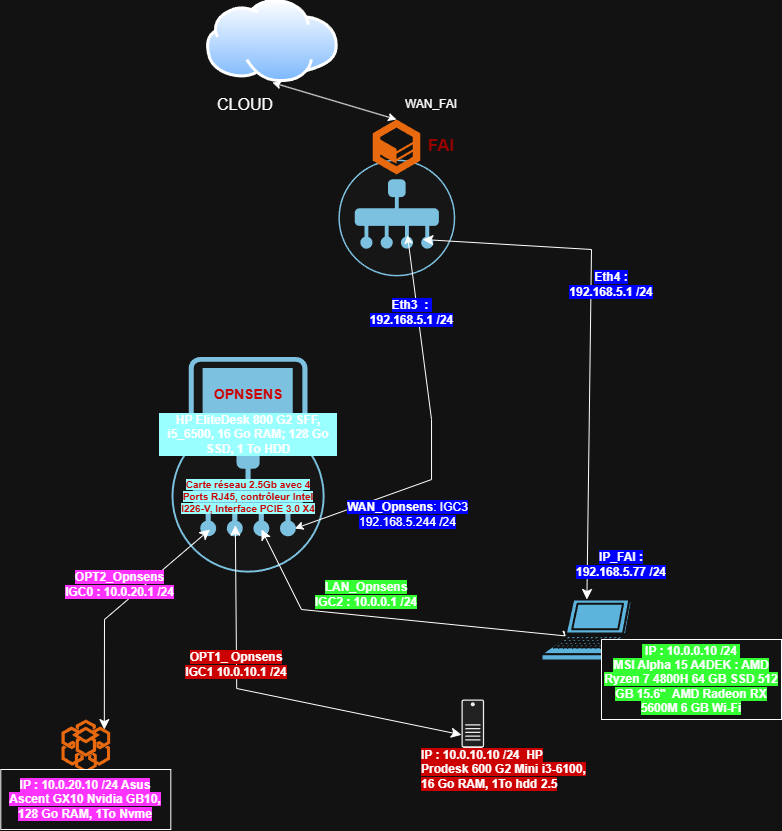

# OPNsense Homelab Security

A fully documented personal network security infrastructure built around **OPNsense**.

Hardened homelab featuring firewall, network segmentation, IDS, WAF, web exposure **without port-forwarding** (Cloudflare Tunnel), SIEM, disk encryption, automated encrypted backups, and professional email.  
Documentation focused on reproducibility, portfolio quality, and technical traceability.

---

## Network Architecture

| Interface | Role | Network | Main machine |
|-----------|------|---------|--------------|
| **WAN** | Internet uplink | ISP network | OPNsense (HP EliteDesk 800 G2) |
| **LAN** | Trusted clients | 10.0.0.0/24 | AlphaDeck (admin workstation) |
| **OPT1** | Bastion zone | 10.0.10.0/24 | **EliteDesk 800 G4** (Rocky Linux 10) |
| **OPT2** | Isolated / Lab zone | 10.0.20.0/24 | Reserved |

**Main bastion (G4 – Rocky Linux 10)**  
- Web services (BunkerWeb) + Cloudflare Tunnel  
- Wazuh SIEM (Dashboard on port 8443)  
- LUKS disk encryption + remote unlock (dracut-sshd)  
- Hardened SSH + Fail2ban  
- Automated encrypted backups with rotation  

**Previous bastion (Prodesk – Debian 12)**  
- Kept as reference / potential honeypot  

---

## Security Stack

| Component | Role | Status |
|-----------|------|--------|
| **OPNsense** | Default-deny firewall, aliases, segmentation | ✅ |
| **Suricata** | Passive IDS (EVE JSON) | ✅ |
| **BunkerWeb** | WAF / reverse-proxy (Docker), multisite | ✅ |
| **Cloudflare Tunnel** | HTTPS exposure without opening ports | ✅ |
| **cloudflared** | Tunnel client running as non-root | ✅ |
| **Email** | `@horus-ais.com` (OVH Zimbra, SPF/DKIM/DMARC) | ✅ |
| **SSH** | Restricted access, key-only, Fail2ban | ✅ |
| **LUKS** | Full disk encryption + remote unlock | ✅ |
| **Wazuh** | All-in-one SIEM (Indexer + Manager + Dashboard) | ✅ |
| **Syslog OPNsense → Wazuh** | filterlog / Suricata collection | ✅ |
| **Wazuh Agent** | AlphaDeck (Windows 10) | ✅ |
| **BunkerWeb / Docker logs → Wazuh** | Collection + Bad Behavior decoding | ✅ |
| **WireGuard** | Remote VPN access (Road Warrior) | ✅ |
| **Encrypted backups** | Daily + Weekly rotation on LUKS volume | ✅ |

### Exposed sites (via tunnel)

| Hostname | Backend | Content |
|----------|---------|---------|
| `horus-ais.com` / `www` | BunkerWeb | Main site |
| `mrdoolux.horus-ais.com` | BunkerWeb | Tests / branding |
| `mrdoolux.brave` | Web3 redirection | Configured |

---

## Documentation

Folder [`docs/`](./docs/) — screenshots in [`images/`](./images/).

> **Note:** Most technical write-ups are currently in French. An English version of key documents will be added progressively.

### Core
- [01 – Architecture](./docs/01-architecture.md)
- [02 – Network](./docs/02-network.md)
- [03 – Firewall state](./docs/03-etat-firewall.md)
- [04 – Firewall rules hardening](./docs/04-Firewall-Rules-Hardening.md)
- [04b – VLANs](./docs/04b-VLANs-Segmentation.md)
- [05 – Prodesk machine state](./docs/05-Etat-machine-Prodesk.md)
- [06 – OPNsense aliases](./docs/06-Aliases-OPNsense.md)
- [07 / 07b – Bastion hardening](./docs/07-Hardening-Bastion.md)
- [07c – Controlled external pentest](./docs/07c-Pentest-Externe-Controle.md)
- [08 – BunkerWeb installation](./docs/08-Installation-BunkerWeb.md)
- [09 – Suricata](./docs/09-Suricata-OPNsense.md)
- [10 – Secure SSH access](./docs/10-Acces-SSH-securise.md)

### Web exposure
- [11 / 11b – Historical approach (port-forward)](./docs/11-BunkerWeb-config-finale.md)
- [15 – Cloudflare Tunnel objective](./docs/15-Objectif-Cloudflare-Tunnel.md)
- [16 – cloudflared installation](./docs/16-Installer-cloudflared.md)
- [20 – cloudflared non-root hardening](./docs/20-Hardening-cloudflared.md)
- [21 – BunkerWeb multisite](./docs/21-Multisite-BunkerWeb.md)
- [22 – Web3 redirection](./docs/22-Redirection-mrdoolux-brave.md)
- [40 – Sites 403 / Real IP Cloudflare](./docs/40%20-%20Sites-en-403-Analyse-et-resolution-Real-IP-Cloudflare-SANITIZED-2026-08-19%20(1).md)

### Email, hardware, ops
- [12 – Domain & email](./docs/12-Domaine-Messagerie-externe.md)
- [14 – Hardware inventory](./docs/14-Inventaire-Hardware.md)
- [17 – LUKS checklist](./docs/17-Checklist-LUKS.md)
- [18 – Firewall rules MVC migration](./docs/18-Migration-Firewall-MVC-API.md)
- [19 – STUN/TURN optimization](./docs/19-Optimisation-STUN-TURN.md)

### Bastion migration to G4 (Rocky Linux)
- [23 – Network install + first SSH](./docs/23%20-%20Rocky%20Linux%20G4%20-%20install%20reseau%20et%20premier%20SSH.md)
- [24 – Users, SSH and shell](./docs/24%20-%20Users%20SSH%20et%20shell%20G4.md)
- [25 – Docker + cloudflared migration](./docs/25%20-%20Docker%20et%20migration%20cloudflared%20G4.md)
- [26 – BunkerWeb multisite migration](./docs/26%20-%20Migration%20BunkerWeb%20multisite%20G4.md)
- [27 – Remote LUKS unlock](./docs/27%20-%20Déverrouillage%20distant%20LUKS%20via%20dracut-sshd%20(G4).md)
- [28 – SSH hardening](./docs/28%20-%20Durcissement%20SSH%20(G4).md)
- [29 – Fail2ban](./docs/29%20-%20Fail2ban%20protection%20brute-force%20SSH%20(G4).md)
- [30 – Wazuh SIEM installation](./docs/30%20-%20Installation%20Wazuh%20SIEM%20(G4).md)
- [30a – Initial Wazuh configuration](./docs/30a%20-%20Paramétrage%20initial%20Wazuh%20(G4).md)
- [31 – OPNsense Syslog → Wazuh](./docs/31%20-%20Intégration%20Syslog%20OPNsense%20→%20Wazuh%20(G4).md)
- [31A – Discover filters & smart alerts](./docs/31A%20-%20Filtres%20Discover%20%26%20Alertes%20intelligentes%20OPNsense%20(G4).md)
- [32 – Wazuh Agent on AlphaDeck](./docs/32%20-%20Agent%20Wazuh%20sur%20AlphaDeck%20(Windows%2010).md)

### Backups, VPN & Advanced monitoring
- [33 – Boot recovery / persistent journal](./docs/33-Incident-Boot-Recovery-Journal-Persistant-BIOS%20(1).md)
- [34 – First full backup (external)](./docs/34%20–%20Premier%20backup%20complet%20de%20la%20G4%20(Rocky%20Linux)%20vers%20disque%20externe.md)
- [35 – Internal LUKS backup volume](./docs/35%20-%20Volume%20de%20backup%20interne%20chiffré%20(LUKS)%20sur%20le%20SSD%20Verbatim%201%20To.md)
- [36 – Backup automation](./docs/36%20–%20Automatisation%20des%20backups%20G4%20+%20OPNsense.md)
- [36A – Backup check-up](./docs/36A-Check-up-backups-G4-OPNsense.md)
- [36B – Backup rotation & retention](./docs/36B%20-%20Rotation%20et%20rétention%20des%20backups%20G4%20(Daily_Weekly).md)
- [37 – G4 maintenance (multi-LUKS fix)](./docs/37-Maintenance-G4-17-aout-2026-Upgrade-Correctif-multi-LUKS-BunkerWeb.md)
- [38 – WireGuard VPN](./docs/38%20-%20WireGuard-VPN-OPNsense-2026-08-18.md)
- [39 – BunkerWeb / Docker logs → Wazuh](./docs/39%20-%20Collecte-logs-BunkerWeb-Docker-Wazuh-SANITIZED-2026-08-19.md)
- [39A – Bad Behavior decoders](./docs/39A%20-%20BunkerWeb-BadBehavior-Wazuh-Decoders-Rules-2026-08-20.md)
- [39B – Enhanced PCRE2 rules](./docs/39B%20-%20Decoder-PCRE2-BadBehavior-Regle-enrichie-Wazuh-2026-08-20.md)

---

## Goal

Build a **reproducible, documented and defensible homelab bastion** following a cybersecurity lab / DevSecOps approach: every step is traced (commands, effects, screenshots, decisions).

---

## Overall Status (20 August 2026)

- [x] OPNsense firewall rebuilt and hardened  
- [x] Suricata operational  
- [x] BunkerWeb + multisite  
- [x] Cloudflare Tunnel + non-root `cloudflared` hardening  
- [x] `@horus-ais.com` professional email  
- [x] Bastion migration to EliteDesk G4 (Rocky Linux)  
- [x] LUKS + remote unlock  
- [x] Hardened SSH + Fail2ban  
- [x] Wazuh all-in-one SIEM  
- [x] OPNsense Syslog → Wazuh  
- [x] Wazuh Agent on admin workstation  
- [x] BunkerWeb / Docker logs ingestion into Wazuh  
- [x] WireGuard VPN (Road Warrior) operational  
- [x] Encrypted backups + daily/weekly rotation  
- [ ] Real website content  
- [ ] Email alerting (Fail2ban / Wazuh / OPNsense)  

---

> Personal cybersecurity lab project — documentation focused on clarity and reproducibility.  
> Repository: [Lu-Suy/Opnsense-homelab-security](https://github.com/Lu-Suy/Opnsense-homelab-security)

**French version available here:** [README.fr.md](./README.fr.md)

